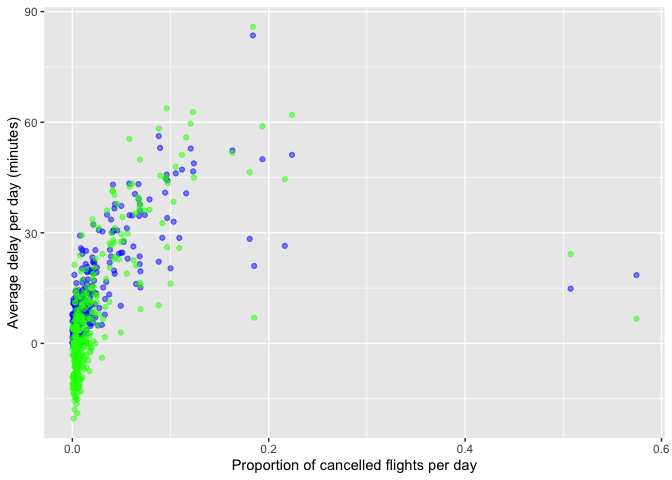

README
================
Lexi Luo
9/27/2021

<https://github.com/QLexiLuo/STAT433-HW2>

## STAT433 HW2

``` r
library(dplyr)
```

    ## Warning: package 'dplyr' was built under R version 3.6.2

    ## 
    ## Attaching package: 'dplyr'

    ## The following objects are masked from 'package:stats':
    ## 
    ##     filter, lag

    ## The following objects are masked from 'package:base':
    ## 
    ##     intersect, setdiff, setequal, union

``` r
library(nycflights13)
```

    ## Warning: package 'nycflights13' was built under R version 3.6.2

``` r
library(ggplot2)
```

    ## Warning: package 'ggplot2' was built under R version 3.6.2

``` r
library(lubridate)
```

    ## Warning: package 'lubridate' was built under R version 3.6.2

    ## 
    ## Attaching package: 'lubridate'

    ## The following objects are masked from 'package:base':
    ## 
    ##     date, intersect, setdiff, union

### Question 1

How many flights have a missing dep\_time? What other variables are
missing? What might these rows represent?

``` r
cancel = filter(flights, is.na(dep_time))
summary(cancel)
```

    ##       year          month             day          dep_time    sched_dep_time
    ##  Min.   :2013   Min.   : 1.000   Min.   : 1.0   Min.   : NA    Min.   : 106  
    ##  1st Qu.:2013   1st Qu.: 3.000   1st Qu.: 8.0   1st Qu.: NA    1st Qu.:1159  
    ##  Median :2013   Median : 6.000   Median :12.0   Median : NA    Median :1559  
    ##  Mean   :2013   Mean   : 5.927   Mean   :14.6   Mean   :NaN    Mean   :1492  
    ##  3rd Qu.:2013   3rd Qu.: 8.000   3rd Qu.:23.0   3rd Qu.: NA    3rd Qu.:1855  
    ##  Max.   :2013   Max.   :12.000   Max.   :31.0   Max.   : NA    Max.   :2359  
    ##                                                 NA's   :8255                 
    ##    dep_delay       arr_time    sched_arr_time   arr_delay      carrier         
    ##  Min.   : NA    Min.   : NA    Min.   :   1   Min.   : NA    Length:8255       
    ##  1st Qu.: NA    1st Qu.: NA    1st Qu.:1330   1st Qu.: NA    Class :character  
    ##  Median : NA    Median : NA    Median :1749   Median : NA    Mode  :character  
    ##  Mean   :NaN    Mean   :NaN    Mean   :1669   Mean   :NaN                      
    ##  3rd Qu.: NA    3rd Qu.: NA    3rd Qu.:2049   3rd Qu.: NA                      
    ##  Max.   : NA    Max.   : NA    Max.   :2359   Max.   : NA                      
    ##  NA's   :8255   NA's   :8255                  NA's   :8255                     
    ##      flight       tailnum             origin              dest          
    ##  Min.   :   1   Length:8255        Length:8255        Length:8255       
    ##  1st Qu.:1577   Class :character   Class :character   Class :character  
    ##  Median :3535   Mode  :character   Mode  :character   Mode  :character  
    ##  Mean   :3063                                                           
    ##  3rd Qu.:4373                                                           
    ##  Max.   :6177                                                           
    ##                                                                         
    ##     air_time       distance           hour           minute     
    ##  Min.   : NA    Min.   :  17.0   Min.   : 1.00   Min.   : 0.00  
    ##  1st Qu.: NA    1st Qu.: 292.0   1st Qu.:11.00   1st Qu.: 5.00  
    ##  Median : NA    Median : 583.0   Median :15.00   Median :27.00  
    ##  Mean   :NaN    Mean   : 695.4   Mean   :14.67   Mean   :25.61  
    ##  3rd Qu.: NA    3rd Qu.: 872.0   3rd Qu.:18.00   3rd Qu.:42.00  
    ##  Max.   : NA    Max.   :4963.0   Max.   :23.00   Max.   :59.00  
    ##  NA's   :8255                                                   
    ##    time_hour                  
    ##  Min.   :2013-01-01 06:00:00  
    ##  1st Qu.:2013-03-07 07:00:00  
    ##  Median :2013-06-12 18:00:00  
    ##  Mean   :2013-06-13 07:07:54  
    ##  3rd Qu.:2013-08-22 15:30:00  
    ##  Max.   :2013-12-31 20:00:00  
    ## 

8255 flights have a missing dep\_time. dep\_delay, arr\_time,
arr\_delay,and air\_time are missing. These rows represent canceled
flights.

### Question 2

Currently dep\_time and sched\_dep\_time are convenient to look at, but
hard to compute with because they’re not really continuous numbers.
Convert them to a more convenient representation of number of minutes
since midnight.

``` r
new_flights = mutate(flights,dep_time = (dep_time %/% 100) * 60 + (dep_time %% 100),
       sched_dep_time = (sched_dep_time %/% 100) * 60 + (sched_dep_time %% 100))

head(new_flights)
```

    ## # A tibble: 6 x 19
    ##    year month   day dep_time sched_dep_time dep_delay arr_time sched_arr_time
    ##   <int> <int> <int>    <dbl>          <dbl>     <dbl>    <int>          <int>
    ## 1  2013     1     1      317            315         2      830            819
    ## 2  2013     1     1      333            329         4      850            830
    ## 3  2013     1     1      342            340         2      923            850
    ## 4  2013     1     1      344            345        -1     1004           1022
    ## 5  2013     1     1      354            360        -6      812            837
    ## 6  2013     1     1      354            358        -4      740            728
    ## # … with 11 more variables: arr_delay <dbl>, carrier <chr>, flight <int>,
    ## #   tailnum <chr>, origin <chr>, dest <chr>, air_time <dbl>, distance <dbl>,
    ## #   hour <dbl>, minute <dbl>, time_hour <dttm>

### Question 3

Look at the number of canceled flights per day. Is there a pattern? Is
the proportion of canceled flights related to the average delay? Use
multiple dyplr operations, all on one line, concluding with
ggplot(aes(x= ,y=)) + geom\_point()

``` r
flights %>%
  mutate(dep_date = make_datetime(year, month, day)) %>%
  group_by(dep_date) %>%
  summarise(cancelled = sum(is.na(dep_delay)), 
            n = n(),
            average_dep_delay = mean(dep_delay,na.rm=TRUE),
            average_arr_delay = mean(arr_delay,na.rm=TRUE)) %>%
    ggplot(aes(x= cancelled/n)) + 
    geom_point(aes(y=average_dep_delay), color='blue', alpha=0.5) + 
    geom_point(aes(y=average_arr_delay), color='green', alpha=0.5) + 
    ylab('Average delay per day (minutes)') +
    xlab('Proportion of cancelled flights per day')
```

    ## `summarise()` ungrouping output (override with `.groups` argument)

<!-- -->

There seems to be a positive relationship between the proportion of
cancelled flights per day to the average delay time per day. The higher
the proportion of cancelled flights per day, the higher average delay
per day in minutes.
